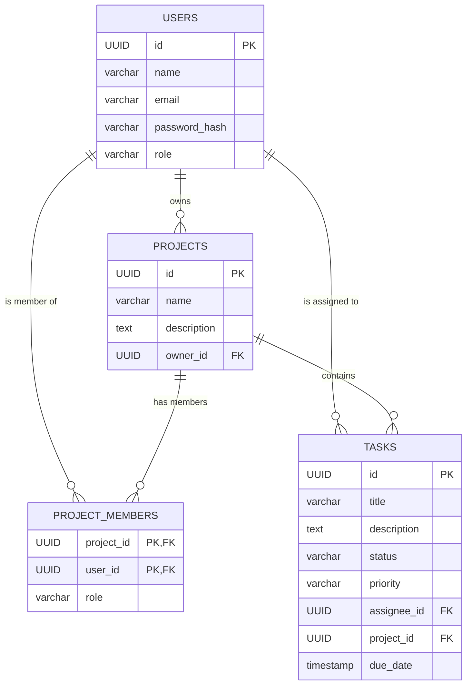

<h1 align="center">Team Task Manager</h1>

<p align="center">
  <strong>A full-stack collaborative project management tool designed to streamline team workflows, task assignments, and progress tracking.</strong>
</p>

<p align="center">
  
  
  
  
  
</p>

<p align="center">
  <a href="#live-demo">Live Demo</a> •
  <a href="#features">Features</a> •
  <a href="#tech-stack">Tech Stack</a> •
  <a href="#api-reference">API</a> •
  <a href="#database-schema">Database</a> •
  <a href="#local-setup">Setup</a>
</p>

---

## 📺 Live Demo & Video

**Live URL:** [Insert Live URL Here]  
**Demo Video:** [Insert YouTube/Loom Link Here]


---

## ✨ Features

- **Authentication & Authorization**: Secure JWT-based signup and login.
- **Role-Based Access Control (RBAC)**:
  - **Admins**: Can create projects, add members, assign roles, and delete tasks/projects.
  - **Members**: Can view project tasks, update task statuses (Todo, In Progress, Done), and manage their assigned work.
- **Project Management**: Create workspaces, invite team members, and oversee multiple projects simultaneously.
- **Kanban Task Board**: Visual task management with customizable priorities (Low, Medium, High) and deadlines.
- **Interactive Dashboard**: Track total tasks, overdue items (highlighted in red), and view personal assignments.
- **Responsive Design**: Beautiful, mobile-friendly UI built with Tailwind CSS.

---

## 💻 Tech Stack

| Category | Technology |
| --- | --- |
| **Frontend** | React, Vite, Tailwind CSS, React Router v6, Axios, Lucide Icons |
| **Backend** | Node.js, Express.js |
| **Database** | PostgreSQL |
| **Security** | JSON Web Tokens (JWT), bcrypt.js, Helmet, CORS |
| **Validation** | Zod |
| **Deployment** | Railway |

---

## 🚀 Local Setup

Follow these instructions to run the project locally.

### Prerequisites
- Node.js (v18+)
- PostgreSQL (Local or Cloud instance)

### 1. Clone the repository
```bash
git clone [Insert GitHub URL]
cd team-task-manager
```

### 2. Backend Setup
```bash
# Navigate to backend directory (assuming it's named team-task-manager)
cd team-task-manager

# Install dependencies
npm install

# Create environment variables
cp .env.example .env
```
Update `.env` with your PostgreSQL `DATABASE_URL` and `JWT_SECRET`. Run the `init.sql` script against your database to create the tables.

```bash
# Start backend server
npm run dev
```

### 3. Frontend Setup
```bash
# Open a new terminal and navigate to frontend directory
cd frontend

# Install dependencies
npm install

# Create environment variables
cp .env.example .env
```
Ensure `VITE_API_URL` is set to your local backend (e.g., `http://localhost:3000/api`).

```bash
# Start frontend server
npm run dev
```

---

## 🔌 API Reference

| Method | Endpoint | Description | Auth Required | Role |
| :--- | :--- | :--- | :---: | :---: |
| `POST` | `/api/auth/signup` | Register a new user | ❌ | Any |
| `POST` | `/api/auth/login` | Authenticate user & get token | ❌ | Any |
| `GET` | `/api/projects` | List projects user has access to | ✅ | Any |
| `POST` | `/api/projects` | Create a new project | ✅ | Any |
| `POST` | `/api/projects/:id/members` | Add a user to a project | ✅ | Admin |
| `GET` | `/api/projects/:id/tasks` | Get all tasks for a project | ✅ | Any |
| `POST` | `/api/projects/:id/tasks` | Create a task in a project | ✅ | Any |
| `PATCH` | `/api/tasks/:id` | Update task status/details | ✅ | Any |
| `DELETE`| `/api/tasks/:id` | Delete a task | ✅ | Admin |
| `GET` | `/api/dashboard` | Get aggregate task statistics | ✅ | Any |
| `GET` | `/health` | Server health check for Railway | ❌ | Any |

---

## 🗄️ Database Schema



---

## 📁 Folder Structure

```text
/
├── team-task-manager/       # Backend Node.js Environment
│   ├── src/
│   │   ├── controllers/     # Route logic
│   │   ├── middleware/      # Auth & Validation
│   │   ├── models/          # DB Schemas/Queries
│   │   ├── routes/          # Express Routers
│   │   └── index.js         # Entry Point
│   ├── init.sql             # Postgres DB Initialization
│   └── railway.toml         # Deployment config
│
└── frontend/                # Frontend React Environment
    ├── src/
    │   ├── api/             # Axios instance
    │   ├── components/      # Reusable UI & Navbar
    │   ├── context/         # AuthContext
    │   ├── pages/           # React Views (Dashboard, Kanban, etc)
    │   ├── App.jsx          # Router setup
    │   └── main.jsx         # React Entry Point
    └── tailwind.config.js
```

---

## 🚂 Deployment Notes (Railway)

1. Attach a **PostgreSQL** database plugin to your Railway project.
2. Run the `init.sql` script within the Railway Data Query tab.
3. Configure Backend variables: `DATABASE_URL` and `JWT_SECRET`.
4. Deploy the frontend repository and set `VITE_API_URL` to point to the live backend URL (`https://your-backend.up.railway.app/api`).
5. Ensure `npm run build` is set as the frontend build command.

---

## 📜 License

This project is licensed under the MIT License - see the [LICENSE](LICENSE) file for details.
